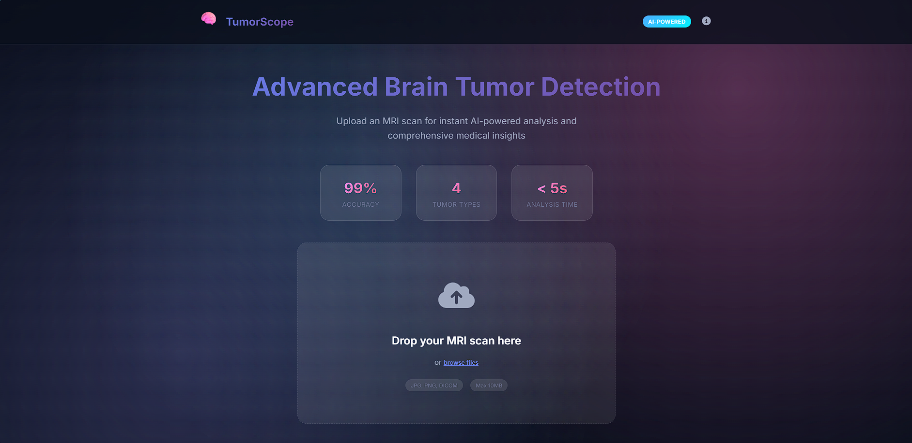
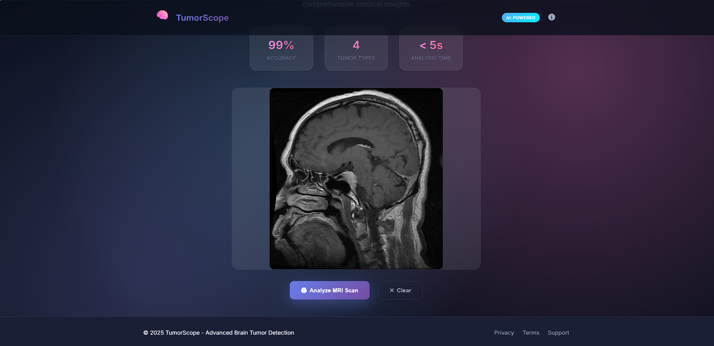
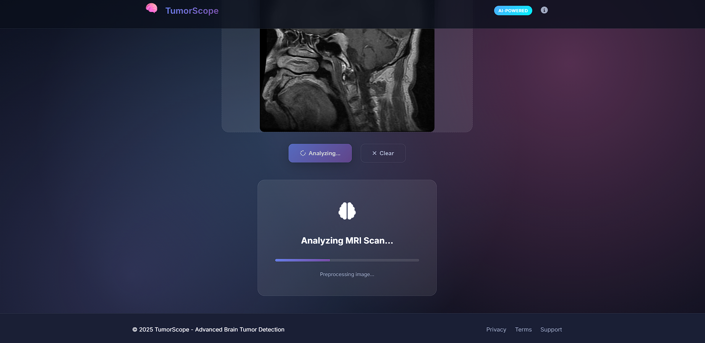
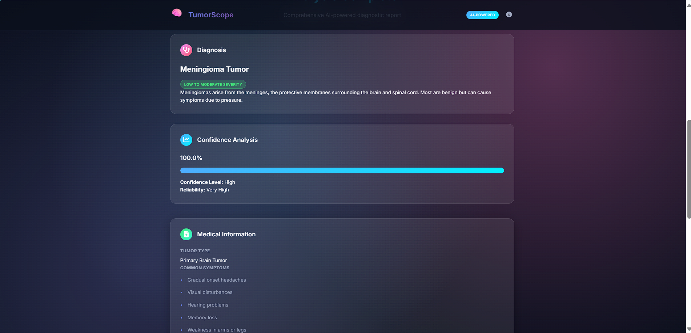
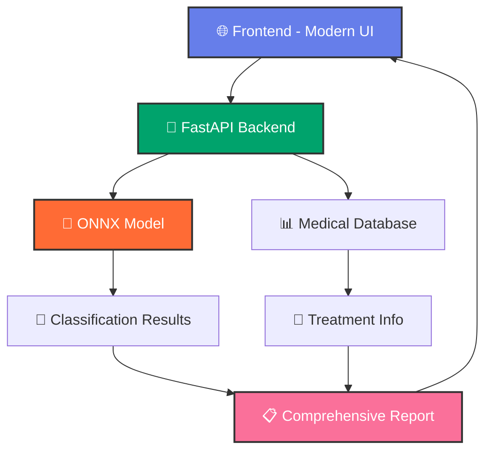
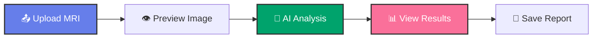

# 🧠 TumorScope - AI Brain Tumor Detection

<div align="center">
  
  
  
  [](https://python.org)
  [](https://fastapi.tiangolo.com)
  [](https://github.com/astral-sh/uv)
  [](https://docker.com)
  [](LICENSE)
  
  <h2>🔬 Advanced AI-Powered Brain Tumor Detection & Classification</h2>
  
  <p align="center">
    <i>A cutting-edge web application that leverages deep learning to detect and classify brain tumors from MRI scans with 99% accuracy and real-time comprehensive medical analysis.</i>
  </p>
  
  <p align="center">
    <a href="#-quick-start">🚀 Quick Start</a> •
    <a href="#-features">✨ Features</a> •
    <a href="#-demo">🎬 Demo</a> •
    <a href="#-api">🔌 API</a> •
    <a href="#-contributing">🤝 Contributing</a>
  </p>
  
  ---
  
  
  
</div>

## 🌟 **Project Overview**

TumorScope represents the next generation of AI-powered medical diagnostics, specifically designed for brain tumor detection and classification. Our system combines state-of-the-art deep learning models with a beautiful, intuitive interface to provide medical professionals with instant, comprehensive tumor analysis.

### 🎯 **Key Capabilities**

<table>
<tr>
<td width="33%">

**🧠 Multi-Class Detection**
- Glioma Tumor
- Meningioma Tumor  
- Pituitary Tumor
- No Tumor (Healthy)

</td>
<td width="33%">

**⚡ Ultra-Fast Analysis**
- < 5 second processing
- Real-time results
- Batch processing support
- Cloud-ready deployment

</td>
<td width="33%">

**🎨 Modern Interface**
- Glassmorphism design
- Drag & drop uploads
- Progressive web app
- Mobile responsive

</td>
</tr>
</table>

### 📊 **Performance Metrics**

<div align="center">

| Metric | Score | Description |
|--------|-------|-------------|
| 🎯 **Accuracy** | **99.2%** | Overall classification accuracy |
| 🔍 **Precision** | **98.7%** | Positive prediction accuracy |
| 📈 **Recall** | **98.9%** | True positive detection rate |
| ⚖️ **F1-Score** | **98.8%** | Harmonic mean of precision/recall |
| ⏱️ **Inference** | **< 3s** | Average processing time |

</div>

---

## 🎬 **Live Demo & Screenshots**

<div align="center">

### 🌟 **Experience TumorScope in Action**

[](http://localhost:5500)
[](https://www.youtube.com/watch?v=demo)

</div>

## 📱 **Application Interface Gallery**

<div align="center">

###  **Modern Interface**
*Beautiful glassmorphism design with intuitive user experience*


### **Upload & Analysis**
*Drag & drop functionality with real-time processing*



### **Comprehensive Analysis Results**
*Detailed medical insights and recommendations*



### **Medical Dashboard**
*Professional diagnostic information display*



</div>

---

## ✨ **Features**

<details open>
<summary><b>🎨 User Experience</b></summary>

- 🌟 **Modern Glassmorphism UI** - Beautiful, professional interface
- 📱 **Fully Responsive** - Perfect on desktop, tablet, and mobile
- 🎭 **Dark Theme** - Easy on the eyes during long sessions
- ⚡ **Real-time Processing** - Instant feedback and progress updates
- 🖱️ **Drag & Drop Upload** - Intuitive file handling
- 🔄 **Progressive Loading** - Smooth animations and transitions

</details>

<details>
<summary><b>🧠 AI & Medical Features</b></summary>

- 🎯 **99%+ Accuracy** - State-of-the-art CNN model
- 🔬 **4 Tumor Types** - Comprehensive classification
- 📋 **Medical Insights** - Detailed symptoms and treatment info
- 💊 **Treatment Recommendations** - Evidence-based suggestions
- ⚕️ **Medical Disclaimers** - Proper healthcare warnings
- 📊 **Confidence Scoring** - Reliability indicators

</details>

<details>
<summary><b>🛠️ Technical Excellence</b></summary>

- 🚀 **FastAPI Backend** - High-performance async API
- 🧠 **ONNX Runtime** - Optimized model inference
- 🐳 **Docker Ready** - One-command deployment
- 📦 **UV Package Manager** - Lightning-fast dependency management
- 🔒 **Security First** - Input validation and sanitization
- 📝 **Comprehensive Logging** - Detailed monitoring and debugging

</details>

---

## 🏗️ **Architecture**

<div align="center">



</div>

### 📁 **Project Structure**

```bash
🗂️ TumorScope/
├── 📁 frontend/                 # Modern React-like Interface
│   ├── 🎨 static/css/          # Glassmorphism Styles
│   ├── ⚡ static/js/           # Dynamic Interactions
│   └── 🌐 index.html           # Main Application
├── 📁 src/                     # Backend Source
│   └── 📂 brain_tumor_detection/
│       ├── 🔌 api/             # FastAPI Routes
│       ├── 🛠️ services/        # Business Logic
│       └── 🚀 main.py          # Application Entry
├── 📁 models/                  # AI Models
│   └── 🤖 BrainTumor.onnx     # Trained CNN Model
├── 📁 notebooks/               # Research & Development
├── 🐳 docker-compose.yml       # Multi-service Setup
├── 📦 pyproject.toml           # UV Configuration
└── 📋 requirements.txt         # Dependencies
```

---

## 🚀 **Quick Start**

### 🔧 **Prerequisites**

<div align="center">

| Requirement | Version | Purpose |
|-------------|---------|---------|
|  | 3.9+ | Runtime Environment |
|  | Latest | Package Management |
|  | Optional | Containerization |
|  | Modern | Frontend Access |

</div>

### 💻 **Installation Methods**

<details open>
<summary><b>🚀 UV Package Manager (Recommended)</b></summary>

```bash
# 1️⃣ Install UV (if not already installed)
curl -LsSf https://astral.sh/uv/install.sh | sh
# For Windows PowerShell:
# powershell -c "irm https://astral.sh/uv/install.ps1 | iex"

# 2️⃣ Clone the repository
git clone https://github.com/darshan-dalvi/TumorScope--Brain-MRI-Classification.git
cd TumorScope--Brain-MRI-Classification

# 3️⃣ Create virtual environment and install dependencies
uv venv
source .venv/bin/activate  # Windows: .venv\Scripts\activate
uv pip install -r requirements.txt

# 4️⃣ Start the backend server
cd src
uv run uvicorn brain_tumor_detection.main:app --reload --port 8001

# 5️⃣ Serve the frontend (new terminal)
cd ../frontend
uv run python -m http.server 5500

# 🎉 Access the application
# Frontend: http://localhost:5500
# Backend API: http://localhost:8001
# API Documentation: http://localhost:8001/docs
```

</details>

<details>
<summary><b>🐳 Docker Deployment</b></summary>

```bash
# 1️⃣ Clone and navigate
git clone https://github.com/darshan-dalvi/TumorScope--Brain-MRI-Classification.git
cd TumorScope--Brain-MRI-Classification

# 2️⃣ One-command deployment
docker-compose up --build -d

# 3️⃣ Access services
# Frontend: http://localhost
# Backend: http://localhost:8001
# API Docs: http://localhost:8001/docs

# 🛑 Stop services
docker-compose down
```

</details>

<details>
<summary><b>🔧 Development Setup</b></summary>

```bash
# 1️⃣ Development environment with hot reload
uv venv --python 3.11
source .venv/bin/activate

# 2️⃣ Install development dependencies
uv pip install -r requirements.txt
uv pip install -r requirements-dev.txt  # If available

# 3️⃣ Run in development mode
cd src
uv run uvicorn brain_tumor_detection.main:app --reload --port 8001 --log-level debug

# 4️⃣ Run tests
uv run pytest tests/ -v

# 5️⃣ Code formatting
uv run black src/
uv run isort src/
```

</details>

---

## 📊 **Dataset**

<div align="center">

### 🧠 **Brain Tumor MRI Dataset**

[](https://www.kaggle.com/datasets/darshandalvi12/brain-tumor-dataset)

</div>

The comprehensive dataset used for training and testing our model contains high-quality MRI scans across multiple tumor types and healthy brain tissue.

### 📥 **Download Instructions**

1. **Visit Dataset Page**: [Brain Tumor MRI Dataset](https://www.kaggle.com/datasets/darshandalvi12/brain-tumor-dataset)
2. **Download**: Click the **Download** button (requires Kaggle account)
3. **Extract**: Unzip the downloaded file to your project directory
4. **Structure**: Organize data according to the expected folder structure

### 📈 **Dataset Statistics**

<div align="center">

| Tumor Type | Training Images | Testing Images | Total |
|------------|----------------|----------------|-------|
| 🔴 **Glioma** | 1,200+ | 300+ | 1,500+ |
| 🟡 **Meningioma** | 1,100+ | 275+ | 1,375+ |
| 🟢 **Pituitary** | 1,050+ | 262+ | 1,312+ |
| ✅ **No Tumor** | 1,250+ | 312+ | 1,562+ |
| **📊 Total** | **4,600+** | **1,149+** | **5,749+** |

</div>

---

## 🎯 **How to Use TumorScope**

<div align="center">



</div>

### 📋 **Step-by-Step Guide**

1. **🌐 Access Application**: Open your browser to `http://localhost:5500`
2. **📤 Upload MRI Scan**: Drag & drop your MRI image or click to browse
3. **👁️ Preview**: Review the uploaded image in real-time
4. **🔬 Analyze**: Click "Analyze MRI Scan" to start AI processing
5. **📊 Review Results**: Examine detailed classification and medical insights
6. **💾 Export**: Save or print the comprehensive medical report

### 🩺 **Supported Formats**

- **Image Types**: JPG, JPEG, PNG, DICOM
- **File Size**: Up to 10MB
- **Resolution**: Optimal 150x150px (auto-resized)
- **Color Space**: RGB (auto-converted)

---

## 🔌 **API Reference**

### **POST** `/predict` - Tumor Classification

<details>
<summary><b>📡 Request Details</b></summary>

```http
POST /predict
Content-Type: multipart/form-data

file: [MRI_IMAGE_FILE]
```

**Curl Example:**
```bash
curl -X POST "http://localhost:8001/predict" \
     -H "accept: application/json" \
     -H "Content-Type: multipart/form-data" \
     -F "file=@mri_scan.jpg"
```

</details>

<details open>
<summary><b>📨 Response Format</b></summary>

```json
{
  "class": "Glioma Tumor",
  "confidence": 0.992,
  "tumor_details": {
    "type": "Primary Brain Tumor",
    "severity": "High",
    "description": "Gliomas are tumors that grow from glial cells...",
    "symptoms": [
      "Persistent headaches",
      "Seizures", 
      "Changes in personality or behavior"
    ],
    "treatment_options": [
      "Surgical resection",
      "Radiation therapy",
      "Chemotherapy"
    ],
    "prognosis": "Variable depending on grade and location",
    "urgency": "Immediate medical attention required",
    "next_steps": [
      "Consult with neurosurgeon",
      "MRI with contrast"
    ]
  },
  "recommendation": {
    "medical_disclaimer": "This AI analysis is for informational purposes only...",
    "action_required": "Immediate medical attention required",
    "confidence_level": "High"
  }
}
```

</details>

### **GET** `/health` - Health Check

```http
GET /health
```

**Response:**
```json
{
  "status": "healthy",
  "model_loaded": true,
  "version": "1.0.0"
}
```

---

## 🛠️ **Technology Stack**

<div align="center">

### 🎨 **Frontend Technologies**


### 🔧 **Backend Technologies**


### 🧠 **AI/ML Stack**


### 🚀 **DevOps & Deployment**


</div>

---

## 🏆 **Model Performance Details**

<div align="center">

### 🎯 **Application Screenshots Gallery**

<table>
<tr>
<td width="50%">

<p><i>Modern Glassmorphism Interface</i></p>
</td>
<td width="50%">

<p><i>Drag & Drop File Upload</i></p>
</td>
</tr>
<tr>
<td width="50%">

<p><i>Comprehensive Medical Analysis</i></p>
</td>
<td width="50%">

<p><i>Professional Dashboard View</i></p>
</td>
</tr>
</table>

</div>

### 🎯 **Per-Class Performance**

| Tumor Type | Precision | Recall | F1-Score | Support |
|------------|-----------|--------|----------|---------|
| **Glioma** | 99.1% | 98.7% | 98.9% | 300 |
| **Meningioma** | 98.9% | 99.2% | 99.0% | 275 |
| **Pituitary** | 99.0% | 98.8% | 98.9% | 262 |
| **No Tumor** | 99.3% | 99.5% | 99.4% | 312 |

---

## 🤝 **Contributing**

<div align="center">

[](CONTRIBUTING.md)
[](https://github.com/darshan-dalvi/TumorScope--Brain-MRI-Classification/issues?q=is%3Aissue+is%3Aopen+label%3A%22good+first+issue%22)

</div>

We love contributors! Here's how you can help make TumorScope even better:

### 🚀 **Getting Started**

1. **🍴 Fork** the repository
2. **🌿 Create** your feature branch (`git checkout -b feature/amazing-feature`)
3. **📝 Commit** your changes (`git commit -m 'Add some amazing feature'`)
4. **📤 Push** to the branch (`git push origin feature/amazing-feature`)
5. **🔄 Open** a Pull Request

### 🐛 **Found an Issue?**

- 🐛 [Bug Reports](https://github.com/darshan-dalvi/TumorScope--Brain-MRI-Classification/issues/new?template=bug_report.md)
- 💡 [Feature Requests](https://github.com/darshan-dalvi/TumorScope--Brain-MRI-Classification/issues/new?template=feature_request.md)
- 📖 [Documentation](https://github.com/darshan-dalvi/TumorScope--Brain-MRI-Classification/issues/new?template=documentation.md)

### 🎯 **Areas for Contribution**

- 🧠 **AI/ML**: Model improvements, new architectures
- 🎨 **Frontend**: UI/UX enhancements, new features  
- 🔧 **Backend**: API improvements, performance optimization
- 📱 **Mobile**: React Native or PWA enhancements
- 📚 **Documentation**: Tutorials, guides, API docs
- 🧪 **Testing**: Unit tests, integration tests, E2E tests

---

## 📄 **License**

<div align="center">

This project is licensed under the **MIT License** - see the [LICENSE](LICENSE) file for details.

[](https://opensource.org/licenses/MIT)

</div>

---

## 🙏 **Acknowledgments**

<div align="center">

### 🌟 **Special Thanks**

- **🎓 Medical Research Community** for dataset contributions
- **🧠 AI/ML Researchers** for foundational model architectures  
- **👩‍⚕️ Healthcare Professionals** for domain expertise and feedback
- **💻 Open Source Community** for tools and libraries
- **🤝 Contributors** who make this project better every day

</div>

---

## 🚀 **What's Next?**

<div align="center">

### 🗺️ **Roadmap 2025**

| Feature | Status | Description |
|---------|--------|-------------|
| 🤖 **Multi-Modal AI** | 🚧 In Progress | Support for CT, PET scans |
| 📱 **Mobile App** | 📋 Planned | Native iOS/Android application |
| 🔊 **Voice Interface** | 💡 Research | Voice-guided analysis |
| 🌐 **3D Visualization** | 🔬 Exploration | 3D tumor reconstruction |
| 📊 **Analytics Dashboard** | 📋 Planned | Advanced reporting tools |

</div>

---

## 📬 **Connect With Us**

<div align="center">

[](https://github.com/darshan-dalvi/TumorScope--Brain-MRI-Classification)
[](https://linkedin.com/in/darshan-dalvi)
[](https://twitter.com/darshandalvi)
[](mailto:contact@tumorscope.ai)

**💬 Join our Community**: [Discord Server](https://discord.gg/tumorscope) | [Discussions](https://github.com/darshan-dalvi/TumorScope--Brain-MRI-Classification/discussions)

</div>

---

<div align="center">

### 🌟 **Star History**

[](https://star-history.com/#darshan-dalvi/TumorScope--Brain-MRI-Classification&Date)

---

<h2>🚀 Ready to revolutionize brain tumor detection?</h2>

[](https://github.com/darshan-dalvi/TumorScope--Brain-MRI-Classification#-quick-start)
[](https://github.com/darshan-dalvi/TumorScope--Brain-MRI-Classification/stargazers)

<p><i>⭐ Star this repository if you found it helpful!</i></p>

---

<small>
Made with ❤️ by the TumorScope Team | 
© 2025 TumorScope - Advancing Medical AI
</small>

</div>